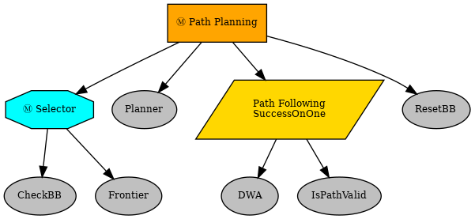

# Hands-On Planning Project: Frontier-Based Exploration with RRT-Connect Path Planner

Team members:
* Alan Limbert Ustariz Zerda
* Sawera Yaseen
* Vania Katherine Mulia

## Overview of Project

This project aims to implement a frontier-based exploration algorithm on Kobuki Turtlebot for autonomous exploration, using	2D LiDAR to generate occupancy grid map used for path planning.

Algorithms used:
* Frontier-based Exploration: Identifies boundaries between known and unknown areas, directing the robot to explore new frontiers. 	
* RRT-Connect: Generate path from start to goal point considering the obstacles in the occupancy grid map.
* DWA: Generate control commands (linear and angular velocities) to the Turtlebot to follow the path considering kinodynamic constraints and avoiding obstacles.

> Change in the final version: replaced DWA with PID controller (since DWA does not work well).

To integrate the algorithms above, a behavior tree is generated to control the sequence of actions required for autonomous exploration (e.g. generate viewpoint, plan path, etc.). The behavior tree can be seen below:



## Contents of This Package

This package contains the nodes below:

* `frontier_exploration_node.py`: node to generate a new viewpoint to explore (i.e. next best viewpoint), called through a service `/compute_next_viewpoint`.
* `turtlebot_path_planner_node.py`: node to generate a path, given the viewpoint generated by `frontier_exploration_node`, called through a service `/plan_path`.
* `controller_node.py`: node containing the low-level controller (initial plan: DWA, final version: PID), called through an actionlib `dwa_act_server`.
* `Main_Node.py`: node containing the behavior tree as described above and call the corresponding services and actionlib.
* `laser_scan_to_point_cloud_node.py`: node to convert 2D LiDAR scan to point cloud, which is then used by octomap server to generate the occupancy grid map.

In addition, the `utils` folder in `src` contains the pure Python implementation of all algorithms mentioned above.

## Dependencies

This package requires another package named `turtlebot_localization`, which is also included in the submission of this project. Besides that, this package also requires `py_trees` library to run the behavior tree, along with other commonly-used Python modules such as `numpy` and `scikit-learn`.

## Running the Package

To run the package on the turtlebot, first run the `kobuki_mobile_base.launch` and `kobuki_sensors.launch` in the turtlebot. Then, run the `turtlebot_localization` package in the turtlebot (through ssh) by running this command line:

```bash
roslaunch turtlebot_localization localization_controller.launch
```

Then, run the following command line:

```bash
roslaunch ho_planning_project launch_project.launch
```

This will launch all nodes in this package except `Main_Node.py`. This allows the services and actionlib to set up before executing the fully-autonomous exploration task.

Finally, run the `Main_Node.py` by the following command line:

```bash
rosrun ho_planning_project Main_Node.py
```

## Visualization

Visualization can be done using Rviz. An Rviz configuration file can be found in the `config` folder. Alternatively, you can find [here](Visualization-List.md) a list of topics that can be used to visualize the algorithms in Rviz.

